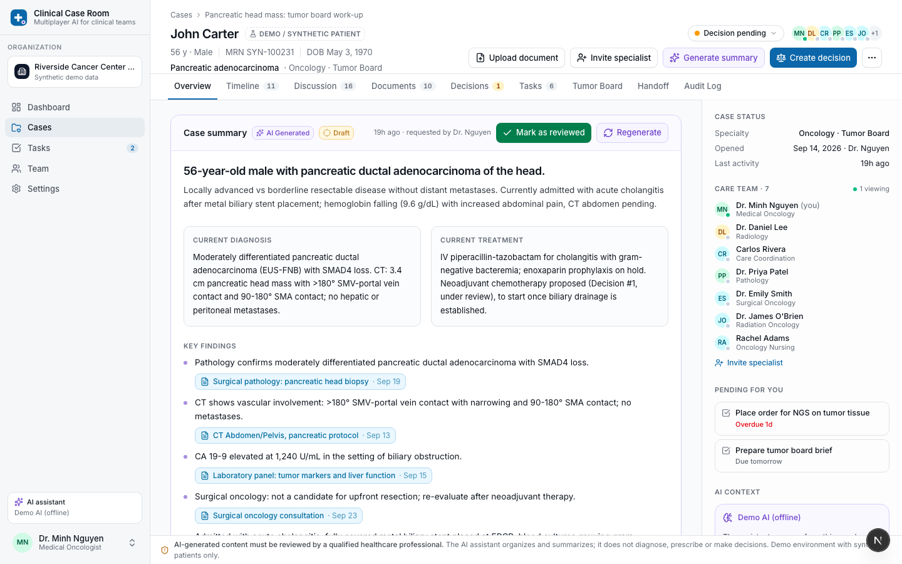
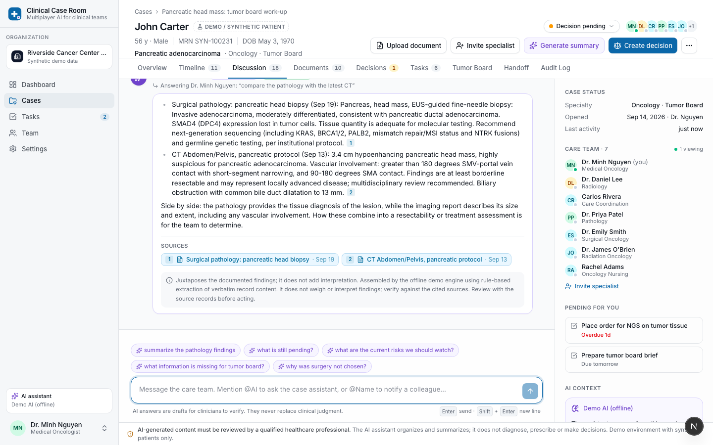
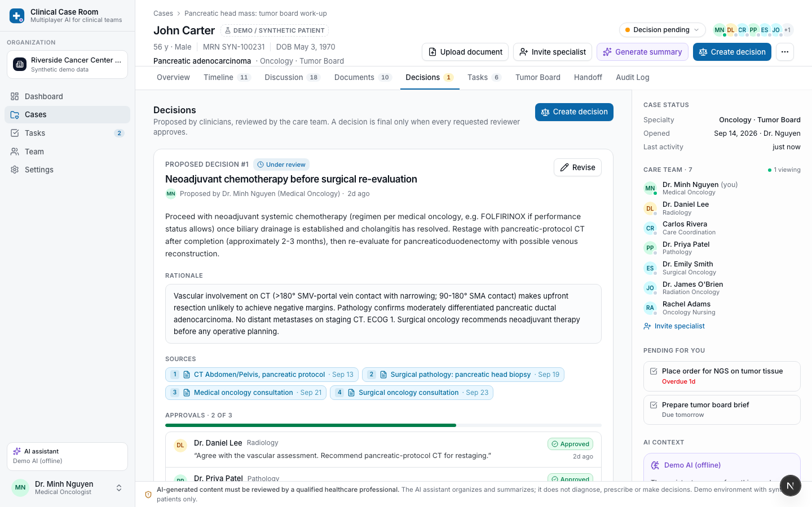
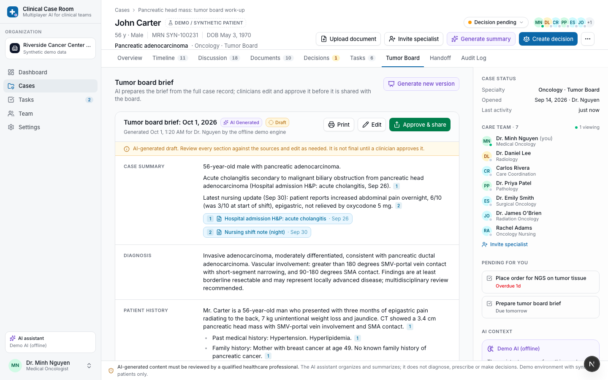
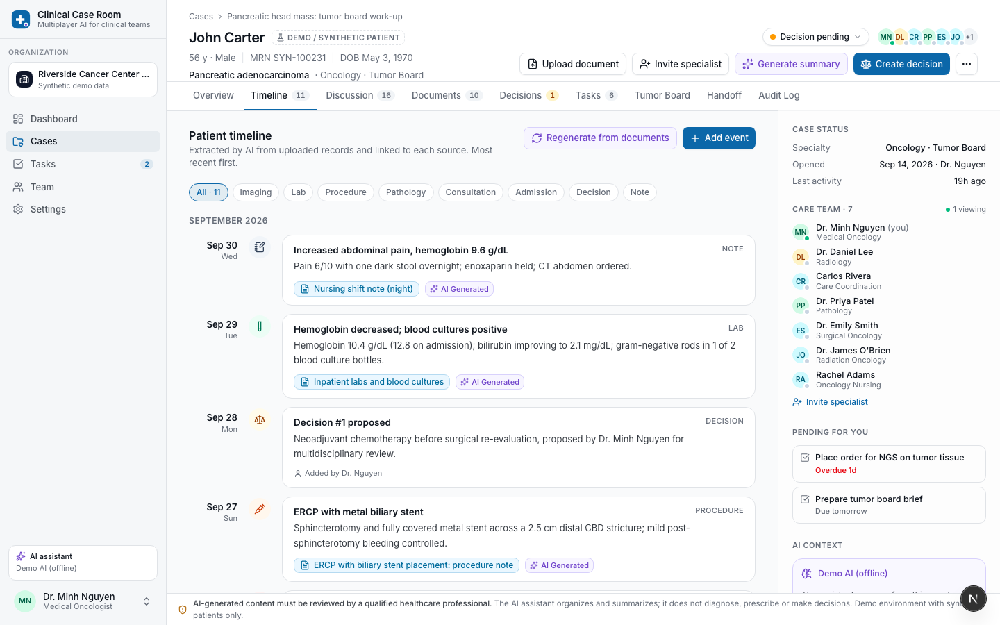

# Clinical Case Room

**Multiplayer AI for clinical teams.**

Clinical Case Room is a multiplayer AI workspace for healthcare teams. Every complex patient gets a shared case room where oncologists, surgeons, radiologists, pathologists, nurses and coordinators work from one patient context, with an AI assistant that serves the whole team: it organizes records, answers questions with evidence, prepares tumor board briefs and handoffs, flags missing information and suggests follow-up tasks. **AI proposes; humans decide.** Every clinical decision requires human review and approval.

> This is an MVP for demonstration. It is **not** a medical device and must not be used with real patient data. All bundled patients are synthetic.

Clinical Case Room is open source under the [GNU AGPL-3.0](LICENSE). Contributions are welcome: see [CONTRIBUTING.md](CONTRIBUTING.md). Please report security issues privately as described in [SECURITY.md](SECURITY.md).



## What the demo shows

| | |
|---|---|
| **One patient, one shared case** | Header, timeline, documents, discussion, decisions, tasks and audit log around a single patient. |
| **Shared patient memory** | Structured memory (problems, diagnoses, labs, imaging, pathology, treatments, open questions) updated automatically as documents arrive. |
| **Multiplayer** | Real-time discussion with presence, typing indicators, mentions (`@DrSmith`) and live updates across browsers. |
| **AI for the whole team** | `@AI` answers any care-team member from the authorized case record, visible to everyone. |
| **Evidence first** | Every AI statement cites source records; fabricated citations are dropped and quotes are verified verbatim. |
| **Human in the loop** | Decisions need approval from every requested reviewer; briefs and handoffs are drafts until a clinician approves them. |
| **Auditability** | Every upload, AI action, decision, approval and task change is recorded in an append-only audit log. |

| Team discussion with evidence-grounded AI | Human approval of a proposed decision |
|---|---|
|  |  |
| **Tumor board brief (AI draft, clinician-approved)** | **Timeline linked to source records** |
|  |  |

## Quick start

Prerequisites: **Node.js ≥ 22.18**, **PostgreSQL 16** (local, or `docker compose up -d postgres`).

```bash
cp .env.example .env            # set DATABASE_URL and AUTH_SECRET (openssl rand -base64 32)
npm install                     # install workspace dependencies
npm run setup                   # prisma generate + migrations + synthetic demo data
npm run dev                     # http://localhost:3000
```

Configuration lives in the root `.env`; the web app, database tools and integration tests load it directly. Restart the web server after changing environment settings.

Sign in with any demo account (password `demo1234`), or click one on the sign-in page:

| Account | Role | Use it to… |
|---|---|---|
| `nguyen@riverside.demo` | Medical oncologist (doctor); also a visiting specialist at Lakeside | Ask the AI, prepare the tumor board, propose decisions; switch organizations in the sidebar |
| `smith@riverside.demo` | Surgical oncologist (specialist) | Approve the pending decision |
| `lee@riverside.demo` | Radiologist (specialist) | Review imaging questions |
| `patel@riverside.demo` | Pathologist (specialist) | Review pathology; has a pending invitation to Lakeside (accept it with the same account) |
| `adams@riverside.demo` | Registered nurse | Generate and approve a shift handoff |
| `rivera@riverside.demo` | Care coordinator | Manage tasks and scheduling |
| `admin@riverside.demo` | Organization admin | Invite members, organization audit log |
| `admin@lakeside.demo` | Admin of the second demo organization | See that cases, members and audit logs stay separate per organization |

One account can belong to several organizations, with a different role in each. The organization menu at the top of the sidebar switches between them and creates new ones.

For a live multiplayer demo, open a second browser profile (or a private window), sign in as another clinician and open the same case. The full 5-minute walkthrough is in [docs/DEMO_SCRIPT.md](docs/DEMO_SCRIPT.md).

## AI providers

The AI layer is provider-agnostic (`packages/ai`). Choose a provider in `.env`:

| Setting | Provider |
|---|---|
| `ANTHROPIC_API_KEY=…` | Anthropic Claude (default model `claude-opus-5-5`, structured outputs, server-side refusal fallback) |
| `OPENAI_API_KEY=…` | OpenAI (Responses API with strict JSON schema; model via `OPENAI_MODEL`) |
| neither | **Demo AI (offline)**: a deterministic, rule-based engine so the whole product works without keys |

`AI_PROVIDER=anthropic|openai|demo` forces a choice. The offline engine is clearly labeled in the UI; it assembles answers from verbatim record content and never generates clinical interpretation. See [docs/AI.md](docs/AI.md).

## Commands

| Command | Description |
|---|---|
| `npm run dev` | Start the web app (Next.js, Turbopack) |
| `npm run build` / `npm run start` | Production build / server |
| `npm run setup` | Generate the Prisma client, apply migrations, seed demo data |
| `npm run db:seed` | Reset the database to the synthetic demo dataset |
| `npm run db:migrate` | Create and apply a new migration (development) |
| `npm run typecheck` | TypeScript across all workspaces |
| `npm run lint` | ESLint (Next.js rules) |
| `npm test` | Unit tests (Vitest) |
| `npm run test:integration` | Service tests against PostgreSQL (row locks, races, atomicity). Needs `TEST_DATABASE_URL` pointing to a separate database whose name ends in `_test`; the tests erase it |
| `npm run test:e2e` | Builds the app and runs the Playwright browser tests of the core demo story against a separate database (`E2E_DATABASE_URL`, name ending in `_e2e`) |

## Project structure

```
apps/
  web/                 Next.js 16 app: pages, server actions, route handlers
    src/app/           routes: dashboard, cases/[caseId]/{timeline,discussion,…}, api/*
    src/components/    UI by feature (case, discussion, decisions, briefs, …)
    src/server/        business logic: auth, authz, services, actions, realtime, storage
packages/
  ai/                  provider-agnostic AI layer
    src/providers/     LLM clients (Anthropic, OpenAI)
    src/context/       case record serialization + citation registry (source grounding)
    src/retrieval/     BM25 passage retrieval
    src/prompts/       system + task prompts
    src/memory/        shared patient memory merge
    src/services/      CaseAIProvider interface, LLM-backed and offline demo implementations
  database/            Prisma schema, migrations, client, synthetic seed data
  types/               shared domain types and schemas (no runtime dependencies on Prisma)
  ui/                  design system (shadcn/ui on Radix)
  config/              shared TypeScript configuration
docs/                  architecture, AI layer, demo script
```

## Tech stack

Next.js 16 (App Router, server actions, Turbopack) · React 19 · TypeScript · Tailwind CSS 4 · shadcn/ui (Radix) · PostgreSQL · Prisma 7 · Auth.js v5 · Server-Sent Events + Postgres LISTEN/NOTIFY · Anthropic / OpenAI SDKs · Vitest · Playwright (for manual E2E checks).

## Safety model

- Persistent notice on every screen: *AI-generated content must be reviewed by a qualified healthcare professional.*
- AI output is labeled **AI Generated**; drafts are labeled **Draft**; human sign-off is labeled **Human Approved**.
- There is no code path through which the AI can approve a decision, brief or handoff. Approvals are created only by authenticated clinicians with the right role.
- The AI does not diagnose, prescribe, select treatments or triage. Follow-up task suggestions never include medication orders and require human confirmation.
- Content in documents and messages is treated as data, not instructions (prompt-injection guard).
- The audit log is append-only; the database rejects `UPDATE` and `DELETE` on audit rows.

More detail in [docs/ARCHITECTURE.md](docs/ARCHITECTURE.md).

## Docker and deployment

- Development: `docker compose up -d postgres` starts PostgreSQL (`docker compose up -d` adds MinIO for S3-compatible storage; set `S3_*` in `.env` to use it). The app runs with `npm run dev`.
- Everything in containers: `AUTH_SECRET=$(openssl rand -base64 32) docker compose --profile app up -d --build`, then `docker compose --profile demo run --rm seed` for the synthetic demo data.
- Deploying for others to use: read [docs/DEPLOYMENT.md](docs/DEPLOYMENT.md) (images, configuration, release steps, reverse proxy, backups, checklist).

## Out of scope for this MVP

EHR/FHIR/HL7/PACS integration, imaging interpretation, billing, prescribing, autonomous agents, voice, mobile apps, and any FDA-regulated diagnostic functionality. The architecture leaves room for these (see *Extension points* in the architecture doc).

## Contributing

Bug reports, ideas and pull requests are welcome. [CONTRIBUTING.md](CONTRIBUTING.md) explains the setup, the checks every pull request must pass, and the rules that matter most in this project: synthetic data only, and the AI never makes a clinical decision. Everyone taking part follows the [Code of Conduct](CODE_OF_CONDUCT.md).

## License

Copyright (C) 2026 C-T Technology Global Inc. and contributors.

This program is free software: you can redistribute it and/or modify it under the terms of the GNU Affero General Public License, version 3, as published by the Free Software Foundation. It is distributed in the hope that it will be useful, but WITHOUT ANY WARRANTY; without even the implied warranty of MERCHANTABILITY or FITNESS FOR A PARTICULAR PURPOSE. See [LICENSE](LICENSE).

If you run a modified version of Clinical Case Room for users over a network, the AGPL requires you to offer those users the source code of your version. Set `SOURCE_CODE_URL` to the repository of your version; the app links to it on every screen.
