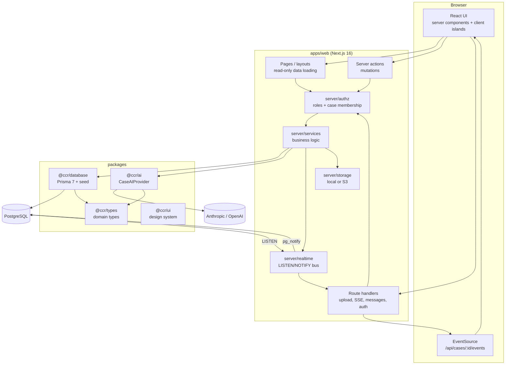
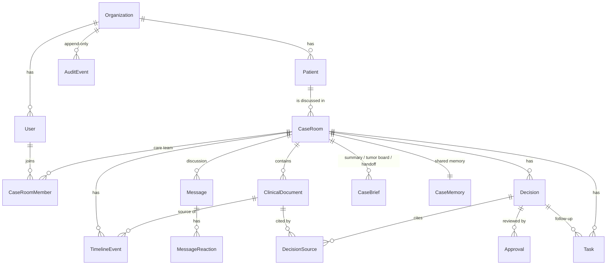

# Architecture

Clinical Case Room is organized around one idea: **the unit of collaboration is the patient case, not the chat.** Every artefact (records, timeline, discussion, AI output, decisions, approvals, tasks, audit) belongs to a `CaseRoom`, and access to a case is limited to its care team.

## Layers and dependency rules

| Layer | Location | Depends on | Never depends on |
|---|---|---|---|
| UI | `apps/web/src/app`, `src/components`, `@ccr/ui` | server actions, DTO types | Prisma, AI providers |
| Mutations | `apps/web/src/server/actions` (`"use server"`) | services, session | Prisma directly |
| Business logic | `apps/web/src/server/services` | authz, `@ccr/database`, `@ccr/ai`, realtime, storage | UI |
| Authorization | `apps/web/src/server/authz` | session user, Prisma (membership) | AI |
| AI | `packages/ai` | `@ccr/types`, LLM SDKs | Prisma, Next.js, the database |
| Data | `packages/database` | Prisma, `@ccr/types` | AI at runtime (the seed uses the demo engine) |

The AI package receives a fully built, **authorized** `CaseContext` (see `packages/types/src/case-context.ts`); it cannot query the database or reach records the requester is not allowed to see.

## Data model

All entities from the product brief are implemented (`Organization`, `User`, `Patient`, `CaseRoom`, `ClinicalDocument`, `TimelineEvent`, `Message`, `Decision`, `Approval`, `Task`, `AuditEvent`). Additions, with reasons:

- `Identity`: a person's sign-in account (email, password). `User` is a membership of one organization (name, handle, role, specialty there); one identity can have several. Everything inside an organization references the `User` row, so data never crosses organizations.
- `CaseRoomMember`: the care team; drives case-level access control and presence.
- `CaseBrief`: AI-generated, human-editable documents with one lifecycle (`DRAFT` → `APPROVED`): case summary, tumor board brief, handoff.
- `CaseMemory`: the shared patient memory as versioned JSON; writers lock the case row, so concurrent updates apply one after the other.
- `DecisionSource`, `MessageReaction`, `Invitation`.
- `ApprovalStatus.PENDING`: a requested reviewer who has not responded yet.
- `AuditEvent.caseRoomId` and `actorType` (`USER` / `AI` / `SYSTEM`): per-case audit views, and a clear record of what the AI did and on whose behalf.
- `Decision.revision` and `CaseBrief.version`: sign-off always names the exact content the clinician read (see *Concurrency*).

## Key flows

### Asking the AI in the discussion

1. `postMessageAction` validates membership and permissions, stores the message, parses `@AI` / `@Handle` mentions, writes `ai.question_asked` to the audit log and publishes `message.created`.
2. The answer runs in `after()` so the sender is not blocked. Viewers receive `ai.thinking` and see the assistant working.
3. `buildCaseContext` loads the authorized record (documents, timeline, decisions, tasks, recent discussion, memory).
4. The provider answers with citations; the `SourceRegistry` resolves them to real records, drops unknown keys and verifies quotes verbatim.
5. The AI message (with sources, confidence and limitations) and its audit row (`ai.answer_generated`, actor `AI`, on behalf of the asker) are written in one transaction, then broadcast.

### Uploading a document

`POST /api/cases/:id/documents` checks permission, case membership and the AI quota **before reading the body**, reads it with a hard byte limit (also for chunked requests), extracts text (PDF via `unpdf`, or plain text), stores the original file (local disk or S3), creates the document, and schedules `processDocument` with `after()`. Processing calls the model for timeline events and memory facts **in parallel**, outside any transaction; then one transaction replaces earlier AI events for that document (re-processing is idempotent), merges the facts into the memory, marks the document completed and writes the audit row. A failure anywhere leaves only the `FAILED` status and its audit row.

`after()` is not a durable queue: if the process dies mid-job, the document stays `PROCESSING` (its `AIRun` stays reserved and keeps counting against the daily budget). A job table with leases, fencing and retries is the production path (see *Extension points*).

### Approving a decision

`reviewDecision` accepts a verdict only from a requested reviewer, and only for the revision the reviewer read. `deriveDecisionStatus` (pure, unit-tested) computes the new status: any rejection rejects it; the decision becomes **final only when every requested reviewer approved**. Finalization writes a system message, a timeline event and a `decision.finalized` audit row, and moves the case out of *Decision pending*.

## Concurrency

Workflows that read, check and then write run in one transaction that first locks the row they depend on (`lockRow`, `SELECT … FOR NO KEY UPDATE`). Concurrent requests wait and then see the committed state, instead of acting on a stale read:

| Workflow | Locked row | Guarantees |
|---|---|---|
| Propose decision | `CaseRoom` | Sequential per-case numbers under concurrent proposals |
| Review / revise decision | `CaseRoom`, then `Decision` | Status always matches the approvals; finalization happens once; a review names the `revision` it read, so a revised decision cannot be approved unread; the case's "decision pending" status is derived after every other decision's change |
| Edit brief | `CaseBrief` | Each edit creates a new `version` |
| Approve brief | `CaseRoom`, then `CaseBrief` | Approval names the version read and is refused otherwise |
| Memory updates (documents, summary) | `CaseRoom` | No lost facts when documents are processed at the same time |
| Role change, invitation | `Organization` | Always at least one admin; one pending invitation per email; distinct mention handles for people joining at once |
| New membership (create or join an organization) | `Identity`, then `Organization` | The per-account membership cap holds under concurrent requests |
| AI budget reservation | advisory lock `ccr-ai-runs` | Quotas cannot be overshot by concurrent requests |

Lock order is fixed to stay deadlock-free: `Identity` → `Organization` → `Invitation`, and `CaseRoom` → `Decision` / `CaseBrief`. Each lock waits at most 3 s (`lock_timeout`); a request that gives up is rolled back and the user sees "someone else is updating this record, please try again" instead of a generic error.

Invitation acceptance and revocation are conditional updates on the invitation row, so exactly one of them wins. Model calls never run inside a transaction; their results, the related state change and the audit row commit together. Organization-level forms (new case, invitation) submit the organization they were opened in, and the server refuses them if another tab has switched the active organization since.

`npm run test:integration` exercises these races against PostgreSQL.

## Abuse limits

The provider key is shared by every organization of a deployment, so AI use is budgeted server-side **before** any model call. Each AI job reserves an `AIRun` row (with the number of model calls it may make) in a serialized transaction that checks: the per-organization rolling 24-hour cap, the number of jobs running at once per organization, and an optional deployment-wide cap. Failed jobs still count (the provider may have charged for them); only reservations released before dispatch do not. A per-person burst limit (per identity, so several organizations do not multiply it) applies too.

Sign-in admits each credentials check synchronously, before any database or password work, and a limit counts recorded failures plus checks still in progress, so a concurrent burst cannot exceed it. Only failures are recorded: per email from one client address (so an attacker elsewhere cannot lock the real user out), per address across emails, and per email across all addresses at a much higher threshold. The account-wide limit does not apply to a browser that has signed in to that account before: a successful sign-in sets an HMAC-signed, httpOnly device cookie (keyed hashes of the accounts, not emails; OWASP "device cookies"), so distributed guessing cannot lock the owner out of their usual browser. A new browser during such an attack waits for the window to pass (no email or SSO recovery yet). Unknown emails still pay for one password check, so timing does not reveal accounts. Signup and invitation acceptance are limited per IP; `PUBLIC_SIGNUP=false` stops self-service organizations. Per-IP limits need a trusted proxy that overwrites `X-Forwarded-For`: never expose `next start` directly. Burst and sign-in counters live in process memory, so a multi-instance deployment should add a shared limiter at the gateway. Uploads being read and extracted at once are capped per process (`MAX_CONCURRENT_UPLOADS`). Values are configured in `.env` (see `.env.example`).

## Realtime

Server-Sent Events per case room, backed by PostgreSQL `LISTEN/NOTIFY`:

- Mutations call `realtime.publish()` → `pg_notify('ccr_case_events', payload)`.
- Each server process keeps one `LISTEN` connection and fans events out to the SSE streams it holds, so it works across multiple instances without Redis.
- Payloads are small invalidation signals (`message.created`, `case.updated` with scopes, `presence`, `typing`, `ai.thinking`); clients refetch or call `router.refresh()`. The discussion also refetches on `case.updated` with the `messages` scope (system messages). Clinical content never travels over the bus.
- Publishing never waits for the listener: every event is sent with NOTIFY (2 s budget), whether or not this process listens yet, so other processes always hear about it. While this process has no `LISTEN` connection, its own subscribers get the event in-process and the connection is set up in the background (5 s budget, then backoff up to 30 s). A committed mutation never hangs on realtime. Events are idempotent invalidations; a rare double delivery only causes an extra refetch.
- Delivery is best effort, without replay. Whenever the server's `LISTEN` connection is established (first time or after a gap), subscribers get a `resync` event. On their first connection, clients compare the case version (`CaseRoom.updatedAt`, read after subscribing) with the one the page was rendered from and resync if it changed; after any reconnect they always resync (refresh the page, refetch the discussion, clear AI activity indicators).
- Presence entries expire after 50 s without a heartbeat and are removed from server memory.

## Authentication and authorization

- **Auth.js v5**, credentials provider, JWT sessions (12 h). The session holds only the identity id; every request reloads the membership (role changes apply immediately). Hospital SSO (OIDC/SAML) can be added as providers.
- **Organizations** are built in, not delegated to an auth vendor. One identity can belong to several organizations with a role in each. The active organization is chosen per browser with an httpOnly cookie (`ccr-org`) and re-checked against the identity's memberships on every request; without a valid cookie the most recently used organization is active. The sidebar switcher changes it, and any member can create another organization (same policy as signup, `PUBLIC_SIGNUP`; at most `MAX_ORGANIZATIONS_PER_ACCOUNT` memberships). An invitation to an email that already has an account is accepted by signing in with that account; a signed-in account can only accept invitations sent to its own email. A link to a case in another of the person's organizations shows a switch prompt instead of a 404. Because the active organization is per browser, switching in one tab also changes it for the other tabs.
- `proxy.ts` only redirects visitors without a session cookie; the real checks live in the data-access layer: every page, action and route calls `requireUser()` and a case-access check.
- **Role permissions** (`server/authz/permissions.ts`): admins manage the organization; doctors and specialists propose and review decisions and approve briefs; nurses add updates, manage tasks and approve handoffs; coordinators manage cases and tasks.
- **Case access**: members of the case's care team, plus organization admins. Non-members get a 404, not a 403, so case existence is not disclosed.

## Architecture decisions (by build phase)

1. **Monorepo with internal TypeScript packages** (npm workspaces). Packages export source; Next.js transpiles them. Clear separation of UI, business logic, database, AI and authorization without a build step per package.
2. **Database: Prisma 7 with the `pg` driver adapter.** Enums mirror `@ccr/types` so domain types stay independent of Prisma. Migrations include a trigger that makes `AuditEvent` append-only.
3. **Authentication: Auth.js credentials + JWT**, chosen over Clerk to run fully offline for demos; the rest of the app depends only on `requireUser()`.
4. **Synthetic data is generated relative to "today"**, so the demo always looks current. Seeded AI artefacts for secondary cases are produced by the same offline engine the app uses.
5. **Server components for reads, server actions for mutations, route handlers for uploads/SSE.** Every mutation revalidates the case layout and broadcasts a realtime signal.
6. **The case room is a layout** (header, tabs, right rail, realtime and action providers) with one route per tab, so every tab is linkable and loads only its data.
7. **Documents and timeline:** text extraction at upload, AI processing after the response (`after()`), every AI timeline event linked to its source document.
8. **Realtime: SSE + LISTEN/NOTIFY** instead of a hosted service (Pusher/Supabase), to keep the stack self-contained and multi-instance-safe.
9. **AI provider abstraction:** a small `LLMClient` (structured JSON generation) under a domain interface `CaseAIProvider` (summary, timeline, Q&A, missing information, handoff, tumor board brief, memory facts, follow-up tasks). Anthropic and OpenAI implement `LLMClient`; an offline engine implements `CaseAIProvider` directly.
10. **Case summary** = summary + missing-information pass, stored as a `CaseBrief` draft; it also refreshes the memory's patient summary and open questions.
11. **Decisions and approvals:** per-case numbering, required reviewers chosen at proposal, pure status derivation, revision resets all reviews.
12. **Tasks:** created manually, from a message, or from AI suggestions after approval; AI-suggested tasks are flagged and always human-confirmed.
13. **Audit:** one `recordAudit` helper called inside the same transaction as each mutation; human-readable descriptions are generated at read time.
14. **Polish:** consistent labels (AI Generated / Draft / Human Approved / Sources), a persistent safety banner, print styles for tumor board briefs.
15. **Hardening after independent code review** (review notes are kept outside the repository): row locks and content versions for sign-off, atomic AI write paths, bounded uploads, AI quotas and sign-in limits, realtime resync.
16. **Multi-organization accounts, built in-house** rather than with Clerk Organizations: Clerk's free tier has only admin/member roles (clinical roles need a paid add-on), it would make the demo depend on an external service, and hospitals may require in-country or on-premise identity. Splitting `Identity` (sign-in) from `User` (membership) kept every existing foreign key and service unchanged.

## Extension points

| Future capability | Where it plugs in |
|---|---|
| EHR / FHIR / HL7 connectors | A new ingestion service creating `ClinicalDocument` rows (and structured observations) from connector payloads; the processing pipeline is unchanged. |
| PACS | Link imaging studies to documents; the AI keeps working from reports only unless a regulated imaging model is added. |
| Guideline and literature retrieval | New retrievers in `packages/ai/src/retrieval`, exposed as an additional context block with their own citation kinds. |
| Fine-tuned or private models | Implement `LLMClient` (for example an on-prem OpenAI-compatible endpoint) and select it in `createCaseAIProvider`. |
| Role-specific agents | Additional `CaseAIProvider` methods or a router choosing prompts by requester role; the authorization boundary stays the `CaseContext`. |
| Hospital SSO | Auth.js OIDC/SAML providers mapped to existing users by email. |
| HIPAA-oriented infrastructure | S3 storage with SSE (already enabled), managed Postgres with encryption at rest, audit export to a SIEM from `AuditEvent`. |
| Multi-hospital organizations | A membership table between users and organizations; access checks already go through `accessibleCaseWhere`. |
| Durable AI jobs | Replace `after()` with a job table (status, lease, attempts) polled by a worker; `AIRun` already records each job. `processDocument` commits its result atomically, but retries need a claim/lease token checked at commit (fencing), so an old worker cannot overwrite a newer one. |
| Multi-instance rate limits | Back `namedLimiter` (`server/rate-limit.ts`) with Redis or the gateway; the daily AI cap already reads from the database. |
